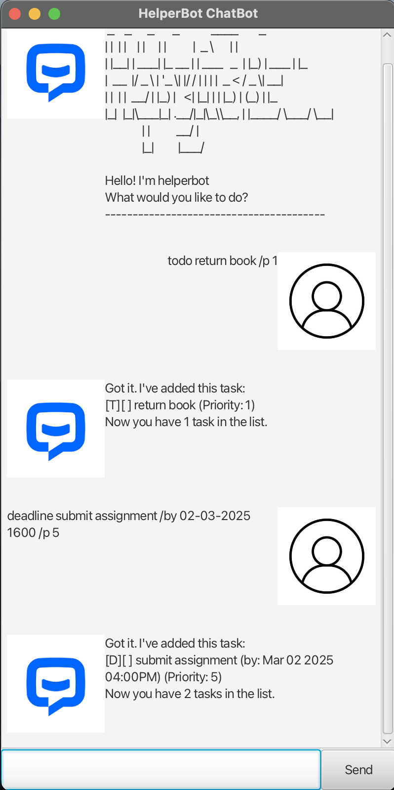

# HelperBot ChatBot User Guide



This is a greenfield Java chatbot project that allows users to add three different kinds of tasks: `ToDo`, `Deadline` and `Event` tasks.

The chatbot has a simple GUI to display its responses to the users and errors are also displayed to the user.

# Contents

- [How to use](#quick-start)
- [Commands](#commands)
  - [Adding Tasks](#adding-tasks)
    - [ToDo](#todo)
    - [Deadline](#deadline)
    - [Event](#event)
    - [Listing Tasks](#listing-tasks)
    - [Marking Tasks](#marking-tasks)
    - [Deleting Tasks](#deleting-tasks)
    - [Finding Tasks](#finding-tasks)
    - [Exit](#exit)
- [Features](#features)
  - [Priority](#priority)

# Quick Start

1. **Download `helperBot.jar`**

   - Go to the repository's [releases page](https://github.com/kevinlimantoro123/ip/releases/tag/A-Release) and download the `tars.jar` file from the release tagged with `A-Release`.

2. **Save the File**

   - Place the downloaded `helperBot.jar` file in a folder

3. **Open Terminal/Command Prompt**

   - Open your terminal

4. **Navigate to the Folder**

   - Use the `cd` command to navigate to the folder where you saved the `helperBot.jar` file. For example:
     ```bash
     cd path/to/your/folder
     ```

5. **Run the Application**
   - Execute the following command to run the `tars.jar` file:
     ```bash
     java -jar helperBot.jar
     ```

# Commands

> Note:
> For all commands, arguments for the command are located within the curly brackets `{}` (THESE FIELDS ARE NEEDED TO RUN).
> The curly brackets not meant to be typed in the command itself.
> Additionally, avoid using the `/` character in the task name as it is reserved for specifying certain commands
> Please see the table below for mroe details

---

| Index |       Command       |                        Format                         |                    Example                    |
|:-----:|:-------------------:|:-----------------------------------------------------:|:---------------------------------------------:|
|   1   |   Add a Todo task   |                  `todo {task name}`                   |                `todo homework`                |
|   2   | Add a Deadline task |      `deadline {task name} /by {deadline date}`       |       `deadline submit ip /by 20-09-24`       |
|   3   |  Add a Event task   | `event {task name} /from {start date} /to {end date}` | `event hackathon /from 23-09-24 /to 25-09-24` |
|   4   |     List tasks      |                        `list`                         |                    `list`                     |
|   5   |     Mark a task     |                 `mark {task number}`                  |                   `mark 1`                    |
|   6   |    Unmark a task    |                `unmark {task number}`                 |                  `unmark 1`                   |
|   7   |    Delete a task    |                `delete {task number}`                 |                  `delete 1`                   |
|   8   |    Find task(s)     |                 `find {search word}`                  |                  `find book`                  |
|   9   |    Give priority    |             `{task command} /p {number}`              |             `todo homework /p 2`              |
|  10   |        Exit         |                         `bye`                         |                     `bye`                     |

---

## Adding Tasks

### ToDo

A ToDo is a simple task that has no start date and no deadline.

Command format: `todo finish homework`

Command example: `todo finish homework` will create a ToDo task to finish homework

Expected output:

```
Got it. I've added this task:
[T][] finish homework (Priority: 0)
Now you have 1 task in the list.
```

### Deadline

A Deadline is a task with an end date

The date specified in the command can be in the following formats (with or without hour/minute):

`yyyy-MM-dd` or `yyyy-MM-dd HHmm` <br>
`yyyy/MM/dd` or `yyyy/MM/dd HHmm` <br>
`dd-MM-yyyy` or `dd-MM-yyyy HHmm` <br>
`dd/MM/yyyy` or `dd/MM/yyyy HHmm` <br>
`MMM dd yyyy` or `MMM dd yyyy hh:mma` <br>

Command format: `deadline {task name} /by {deadline date}`

Command example: `deadline submit assignment /by 15-01-2025 1645`

Expected Output:

```
Got it. I've added this task:
[D][] submit assignment (by: Jan 15 2025 04:45PM) (Priority: 0)
Now you have 1 task in the list.
```

### Event

An event is a task with a start date and an end date.

The dates specified in the command has to be in the same formats as the deadline formats:

`yyyy-MM-dd` or `yyyy-MM-dd HHmm` <br>
`yyyy/MM/dd` or `yyyy/MM/dd HHmm` <br>
`dd-MM-yyyy` or `dd-MM-yyyy HHmm` <br>
`dd/MM/yyyy` or `dd/MM/yyyy HHmm` <br>
`MMM dd yyyy` or `MMM dd yyyy hh:mma` <br>

Command format: `event {task name} /from {start date} /to {end date}`

Command example: `event go on holiday /from 01-01-2025 /to 01-03-2025`

Expected Output:

```
Got it. I've added this task:
[E][] go on holiday (from: Jan 01 2025 to: Mar 01 2025) (Priority: 0)
Now you have 1 task in the list.
```

## Listing tasks

To print all the tasks that have been created simply type the command `list`.

Assuming you followed the previous 3 steps above, the list should look as given below.

Command format: `list`

Expected output:

```
Here are the tasks in your list:
1. [T][] finish homework (Priority: 0)
2. [D][] submit assignment (by: Jan 15 2025 04:45PM) (Priority: 0)
3. [E][] go on holiday (from: Jan 01 2025 to: Mar 01 2025) (Priority: 0)
```

## Marking tasks

Users can mark tasks that they have finished by specifying an index

Command format: `mark {task number}`

Command example: `mark 1`

Expected output:

```
Nice! I've marked this task:
[T][X] finish homework (Priority: 0)
```

Users can unmark tasks that they have finished by specifying an index

Command format: `unmark {task number}`

Command example: `unmark 1`

Expected output:

```
Nice! I've unmarked this task:
[T][] finish homework (Priority: 0)
```

## Deleting tasks

Users can also delete tasks with the `delete` command.

Command format: `delete {task number}`

Command example: `delete 1`

Expected output:

```
Noted. I've removed this task:
[T][] finish homework (Priority: 0)
Now you have 2 tasks in the list.
```

## Finding Tasks

Users can find all tasks that match the keyword given. The original index of the task is also displayed

Command format: `find {search word}`

Command example: `find assignment`

Expected output:

```
Here are the tasks found.
2. [D][] submit assignment (by: Jan 15 2025 04:45PM) (Priority: 0)
```

## Exit

Users can exit the chatbot with the `bye` command. After 2 seconds, the app will automatically close.

Command format: `bye`

Expected output:

```
Bye! Hope to see you again soon!
```

# Features

## Priority

Users can specify the priority of their tasks by adding `/p {number}` after a task command. This will label the corresponding task with a priority value

Users can also choose to not include a priority for their tasks and it will be given a default priority of 0.

Command format: `{task command} /p {number}`

Command example: `todo study for test /p 5`

Expected outpu:

```
Got it. I've added this task:
[T][] study for test (Priority: 5)
Now you have 1 task in the list.
```
